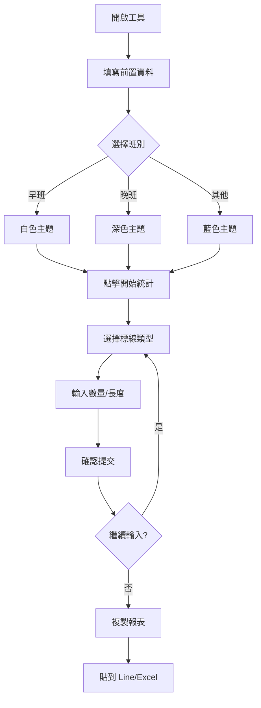
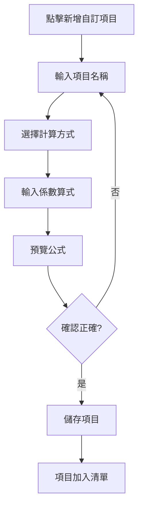

# 產品需求文件 (PRD)
## 道路標線施工統計工具

**版本：** 1.0  
**最後更新：** 2026-01-12  
**負責人：** 施工管理團隊

---

## 1. 產品概述

### 1.1 產品定位
道路標線施工統計工具是一款為道路標線施工人員設計的現場數據記錄與統計工具，支援快速輸入施工數據、自動計算面積、生成施工日報表。

### 1.2 目標使用者
- **主要使用者**：道路標線施工現場作業人員
- **次要使用者**：施工管理人員、品質稽核人員
- **使用場景**：戶外施工現場、行動裝置、需要快速記錄

### 1.3 核心價值
- ⚡ **快速記錄**：優化的鍵盤導航與語音提示，提升現場記錄效率
- 🎯 **精準計算**：80+ 種預設標線類型，自動計算面積
- 📱 **行動友善**：響應式設計，支援手機與平板
- 📋 **即時報表**：一鍵複製格式化報表，直接貼到 Line 或 Excel

---

## 2. 功能需求

### 2.1 前置作業表單

#### 功能描述
施工前填寫基本資訊，包含日期、人員、班別、狀態、業主、施工地點、車輛。

#### 詳細需求

| 欄位 | 類型 | 說明 | 預設值 |
|------|------|------|--------|
| 施工日期 | 日期選擇器 | 當日施工日期 | 當天日期 |
| 填表人員 | 單選按鈕 | 從預設清單選擇 | 無 |
| 班別 | 單選按鈕 | 早班/晚班/加班/支援/臨時/其他 | 無 |
| 狀態 | 單選按鈕 | 已完工/未完工 | 無 |
| 業主 | 單選按鈕 | 從預設業主清單選擇 | 無 |
| 施工地點 | 單選按鈕 | 按區域分組的地點清單 | 無 |
| 車輛 | 單選按鈕 | A車/B車/C車/D車/X車/Y車/Z車/其他 | 無 |

#### 特殊功能
- **班別主題切換**：
  - 早班 → 白色背景 (提升日光下可讀性)
  - 晚班 → 深色背景 (減少夜間眩光)
  - 其他 → 藍色背景 (區別特殊班次)

### 2.2 標線類型管理

#### 功能描述
提供 80+ 種預設道路標線類型，支援自訂項目。

#### 分類架構
- **A. 10cm 道路標線**：白線、黃線、紅線、藍線、雙黃線等
- **B. 15cm 道路標線**：白邊線、待轉區、公車格等
- **C. 40cm 道路標線**：停止線、行穿線、黃棋盤標線
- **D. 停等區與車格類**：機車格、汽車格、計程車格、殘障格等
- **E. 字模標線**：箭頭、符號、速限、文字等
- **F. 內外型標線**：黃網線、槽化線
- **G. 其他與未分類**：減速標線、導盲線、彩色標線、MMA 材料
- **H. 非標線施工項目**：貓眼、防撞桿（計次不計面積）

#### 計算模式
1. **線性計算（linear）**：輸入長度(m) × 係數 = 面積(m²)
2. **數量計算（count）**：輸入數量 × 係數 = 面積(m²)
3. **計次統計（item）**：純數量統計，不計面積

#### 自訂項目
- 使用者可新增自訂項目
- 需指定：名稱、計算方式、係數算式
- 自訂項目自動歸類至 G 或 H 區

### 2.3 數據輸入界面

#### 數字鍵盤
- 0-9 數字鍵
- 小數點(.)
- 刪除鍵 (DEL)：刪除最後一位
- 清空鍵 (AC)：清空輸入
- 確認鍵 (Enter)：提交數據

#### 顯示畫面
- 當前選擇的標線類型
- 輸入數值與單位
- 即時計算預覽（公式與結果）
- 修改規格按鈕

### 2.4 鍵盤操作

#### 導航快捷鍵
- **W / ↑**：向上移動焦點
- **S / ↓**：向下移動焦點
- **A / ←**：向左移動焦點
- **D / →**：向右移動焦點
- **空白鍵**：選取當前項目
- **Enter**：確認/下一步
- **P**：複製報表

#### 數字輸入快捷鍵
- **0-9**：直接輸入數字
- **.**：輸入小數點
- **Backspace**：刪除
- **Escape**：清空

### 2.5 統計列表

#### 功能描述
顯示已輸入的所有施工項目，支援刪除與總計顯示。

#### 列表項目顯示
- 標線名稱
- 輸入值與單位
- 計算係數
- 計算面積（或數量）
- 刪除按鈕

#### 總計顯示
頂部顯示所有標線項目的面積總和。

### 2.6 報表生成

#### 報表格式
```
【道路標線施工日報表】
日期: YYYY-MM-DD
人員: XXX | 班別: XXX | 狀態: XXX
業主: XXX | 車輛: XXX
地點: XXX
------------------------
白線:(3+5+2)=10m*0.1=1.00m²
停止線:15m*0.4=6.00m²
1m行穿線:8條*1*0.4=3.20m²

標線總計:(1.00+6.00+3.20)=10.20m²
------------------------
【非標線施工項目】
黃貓眼總計:(5+3)=8個
```

#### 複製功能
- 一鍵複製格式化報表
- 可直接貼到 Line、Excel、記事本
- 複製成功顯示提示訊息

### 2.7 音效與語音

#### 音效設計
- **點擊音效**：叮咚聲（確認輸入）
- **頁面切換音**：上升/下降音階
- **複製成功音**：勝利音效

#### 語音提示
- 選擇人員、地點、標線類型時自動語音播報
- 使用瀏覽器內建 TTS（中文語音）
- 可一鍵開關聲音

### 2.8 資料持久化

#### LocalStorage 儲存
- **marking_types**：標線類型清單（含自訂項目）
- 每次操作自動儲存
- 重新整理不遺失資料

#### 資料復原
- 首次載入時檢查 localStorage
- 若無資料或格式錯誤，載入預設值
- 自訂項目自動保留

---

## 3. 非功能需求

### 3.1 效能需求
- 頁面載入時間 < 2 秒
- 按鍵回應時間 < 100ms
- 支援至少 500 筆歷史記錄

### 3.2 相容性需求
- **瀏覽器**：Chrome 90+, Edge 90+, Safari 14+, Firefox 88+
- **裝置**：桌面、平板、手機
- **螢幕尺寸**：320px ~ 2560px

### 3.3 可用性需求
- 支援觸控操作
- 支援鍵盤完整操作
- 單手操作友善（行動裝置）
- 戶外陽光下可閱讀
- 夜間模式（晚班主題）

### 3.4 安全性需求
- 資料僅儲存在本地瀏覽器
- 無需網路連線即可使用
- 不涉及個人隱私資料上傳

---

## 4. 技術架構

### 4.1 技術選型
- **前端框架**：無框架，純 HTML + CSS + JavaScript
- **UI 框架**：Tailwind CSS (CDN)
- **圖示庫**：Lucide Icons (CDN)
- **音效**：Web Audio API
- **語音**：Web Speech API (SpeechSynthesis)

### 4.2 檔案結構
```
道路標線施工統計工具.html  (單一檔案，便於部署)
```

### 4.3 資料格式

#### 標線類型結構
```javascript
{
  id: 'white_line',           // 唯一識別碼
  name: '白線',                // 顯示名稱
  category: 'A',              // 分類 (A-H)
  type: 'linear',             // 計算類型 (linear/count/item)
  factors: [0.1],             // 計算係數陣列
  color: 'bg-blue-50 ...'     // Tailwind CSS 類別
}
```

#### 歷史記錄結構
```javascript
{
  id: 1673511234567,          // 時間戳記
  typeId: 'white_line',       // 標線類型 ID
  name: '白線',                // 標線名稱
  category: 'A',              // 分類
  inputType: 'linear',        // 計算類型
  factors: [0.1],             // 係數
  inputValue: 10.5,           // 輸入值
  area: 1.05                  // 計算面積
}
```

---

## 5. 使用者流程

### 5.1 標準工作流程


### 5.2 自訂項目流程


---

## 6. 限制與約束

### 6.1 已知限制
- 報表格式固定，無法自訂樣式
- 歷史記錄僅在當前瀏覽器有效
- 無法批次匯入資料
- 無協作功能（多人同時編輯）

### 6.2 瀏覽器限制
- LocalStorage 容量限制（約 5-10MB）
- 語音合成需瀏覽器支援
- 音效需使用者互動後才能播放

---

## 7. 未來規劃

### 7.1 短期規劃 (1-3 個月)
- [ ] 支援 JSON 格式匯出/匯入
- [ ] 歷史記錄搜尋與篩選
- [ ] 報表樣式自訂選項
- [ ] 離線 PWA 支援

### 7.2 中期規劃 (3-6 個月)
- [ ] 照片附件功能
- [ ] GPS 定位與地圖標記
- [ ] 多語言支援
- [ ] 雲端同步（可選）

### 7.3 長期規劃 (6-12 個月)
- [ ] 團隊協作功能
- [ ] 管理後台
- [ ] 數據分析儀表板
- [ ] API 整合

---

## 8. 成功指標

### 8.1 使用者體驗指標
- 單筆記錄平均輸入時間 < 10 秒
- 鍵盤操作覆蓋率 > 95%
- 行動裝置可用性評分 > 4.0/5.0

### 8.2 功能指標
- 標線類型覆蓋率 > 90%（涵蓋常見標線）
- 計算準確率 100%
- 報表格式通過率 > 98%

### 8.3 穩定性指標
- 無資料遺失事故
- 相容性問題 < 5%
- 崩潰率 < 0.1%

---

## 附錄

### A. 術語表

| 術語 | 說明 |
|------|------|
| 標線 | 道路上的漆面標記，如白線、黃線、行穿線等 |
| 面積計算 | 依據標線長度/數量 × 係數計算施工面積 |
| 計次項目 | 僅統計數量不計算面積的項目（如貓眼、防撞桿） |
| 係數 | 用於面積計算的乘數（如 10cm 寬 = 0.1） |
| 熱拌 | 熱熔型標線材料 |
| MMA | 冷塑型高耐磨止滑材料 |

### B. 參考資料
- 道路交通標誌標線號誌設置規則
- 交通部公路總局標準規範
